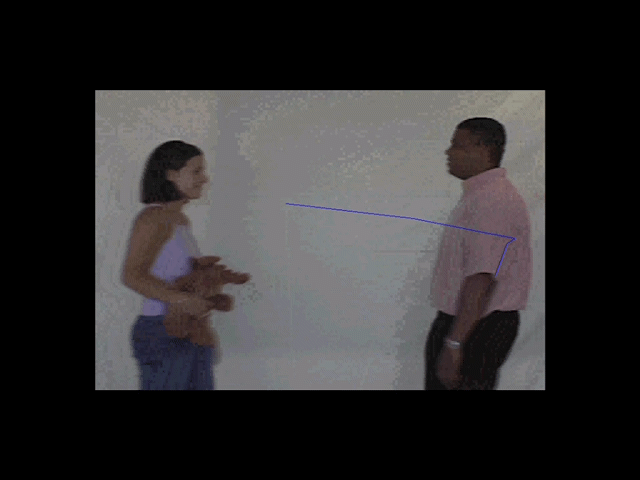
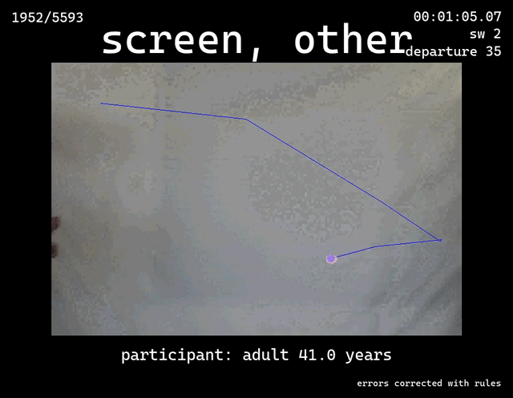

# Eye-Track-ML: Automating Frame-by-Frame Analysis of Eye-Tracking Videos

A machine learning pipeline for automated analysis of infant eye-tracking videos, processing thousands of frames efficiently.

<table style="margin: auto;">
  <tr>
    <td style="text-align: center;">
      
    </td>
    <td style="vertical-align: middle; text-align: center; font-size: 6rem; padding: 0 40px; font-weight: bold;">
      ➡️
    </td>
    <td style="text-align: center;">
      
    </td>
  </tr>
  <tr>
    <td style="text-align: center; padding-top: 10px;">
      <strong>Infant Event Representations Original</strong><br>
      <a href="https://youtu.be/jo3Jfh5NhLM" target="_blank">YouTube Video of original</a>
    </td>
    <td></td>
    <td style="text-align: center; padding-top: 10px;">
      <strong>Infant Event Representations V2</strong><br>
      <a href="https://youtu.be/JsbvKOgkfCk" target="_blank">YouTube Video of V2</a>
    </td>
  </tr>
</table>

We begin with ~75 participant video files (~300 minutes / 540k frames) that would take many hours to code by hand. This ML-powered and rule-based verified workflow automates the process, outputting labeled video files and accompanying datasheets.

## Project Structure
```
.
├── 0_participant_videos/     # Raw participant video files (.avi)
├── 1_preprocessing.py        # Frame extraction and standardization
├── 2_inference_subjects.py   # Subject detection (YOLO + SAM2)
├── 3_datasheet_subjects.py   # Subject data compilation
├── 4_inference_background.py # Event classification
├── 5_datasheet_background.py # Event data compilation
├── 6_consolidation.py        # Data merging and validation
└── 7_movie.py               # Final video generation
```

## Pipeline Overview

### 1. Preprocessing (`1_preprocessing.py`)
- Extracts individual frames from AVI videos using ffmpeg
- Standardizes frames to 1024×1024 resolution with padding
- Creates organized frame directories for each participant
- Real-time progress monitoring with ETA
- Output: `1_preprocessing_output/{video_name}-1024-frames/`

### 2. Subject Inference (`2_inference_subjects.py`)
- Detects key objects using YOLO and SAM2 models
- Identifies: blue dot, faces, hands, toys, etc.
- GPU-optimized with concurrent processing
- Creates detection data (JSON) and visual overlays
- Output: `2_inference_subjects_output/{name}-segmentation/`

### 3. Subject Data Compilation (`3_datasheet_subjects.py`)
- Analyzes object detection results
- Maps blue dot overlap with detected objects
- Determines "What" (object type) and "Where" (location)
- Creates frame-by-frame analysis sheets
- Output: `3_datasheet_subjects_output/{participant}-datasheet.csv`

### 4. Event Classification (`4_inference_background.py`)
- Classifies frames into event categories
- Uses local inference server for classification
- Categories: green_dot, f, gw, gwo, hw, etc.
- Creates event detection data and summaries
- Output: `4_inference_background_output/{name}-inference/`

### 5. Event Data Compilation (`5_datasheet_background.py`)
- Processes classification results
- Groups events into trials and segments
- Handles corrections and refinements
- Creates comprehensive event datasheets
- Output: `5_datasheet_background_output/{participant}-datasheet-background.csv`

### 6. Data Consolidation (`6_consolidation.py`)
- Merges subject and event data
- Combines detection data with event classifications
- Creates final consolidated datasets
- Output: `6_consolidation_output/{participant}.csv`

### 7. Video Generation (`7_movie.py`)
- Creates annotated videos with information overlays
- Shows frame info, events, timing, and metadata
- Configurable overlay options (left, right, bottom)
- Uses ffmpeg for high-quality frame composition
- Output: Final MP4s with annotations

## Requirements

### System Requirements
- Windows 10/11 or Linux
- Python 3.8 or higher
- CUDA-capable GPU (minimum 6GB VRAM recommended)
- 16GB RAM minimum, 32GB recommended
- 500GB free disk space for processing and outputs
- ffmpeg installed and available in system PATH

### Software Dependencies
1. **Core Python Packages**
   - numpy (≥1.21.0)
   - pandas (≥1.3.0)
   - pillow (≥8.3.0)
   - tqdm (≥4.61.0)

2. **Machine Learning & Computer Vision**
   - PyTorch (≥1.9.0)
   - TorchVision (≥0.10.0)
   - OpenCV Python (≥4.5.3)
   - Segment Anything Model (SAM2)

3. **Services & APIs**
   - Local Roboflow Inference Server
   - YOLO object detection model
   - API key for model access

4. **Additional Tools**
   - ffmpeg for video processing
   - Docker (for running inference server)

### External Services
- Roboflow account with API access
- Models required:
  - Object detection model (YOLO) for subject detection
  - Classification model for event recognition

### Installation Steps
1. Install Python dependencies:
   ```bash
   pip install -r requirements.txt
   ```

2. Install ffmpeg:
   - Windows: Download from https://ffmpeg.org/download.html
   - Linux: `sudo apt-get install ffmpeg`

3. Set up Roboflow Inference Server:
   ```bash
   docker run -d --gpus all -p 9001:9001 \
   -e ROBOFLOW_API_KEY=your_key \
   -v /path/to/cache:/tmp/cache \
   roboflow/roboflow-inference-server-gpu:latest
   ```

4. Environment Setup:
   - Create a `.env` file with your API keys and model IDs
   - Ensure CUDA toolkit is installed if using GPU
   - Add ffmpeg to system PATH

### Optional Dependencies
- VS Code with Python extension (recommended for development)
- NVIDIA GPU drivers and CUDA toolkit for GPU acceleration
- Git LFS for handling large model files

## Setup and Usage

1. Clone the repository:
```bash
git clone https://github.com/YOUR_USERNAME/eye-track-ml.git
cd eye-track-ml
```

2. Install dependencies as outlined in the Requirements section

3. Place participant videos in `0_participant_videos/`

4. Run the pipeline scripts in sequence:
```bash
python 1_preprocessing.py
python 2_inference_subjects.py
python 3_datasheet_subjects.py
python 4_inference_background.py
python 5_datasheet_background.py
python 6_consolidation.py
python 7_movie.py
```

## License
MIT

## Acknowledgments
[Language and Cognitive Lab](https://www.tc.columbia.edu/lcl/)