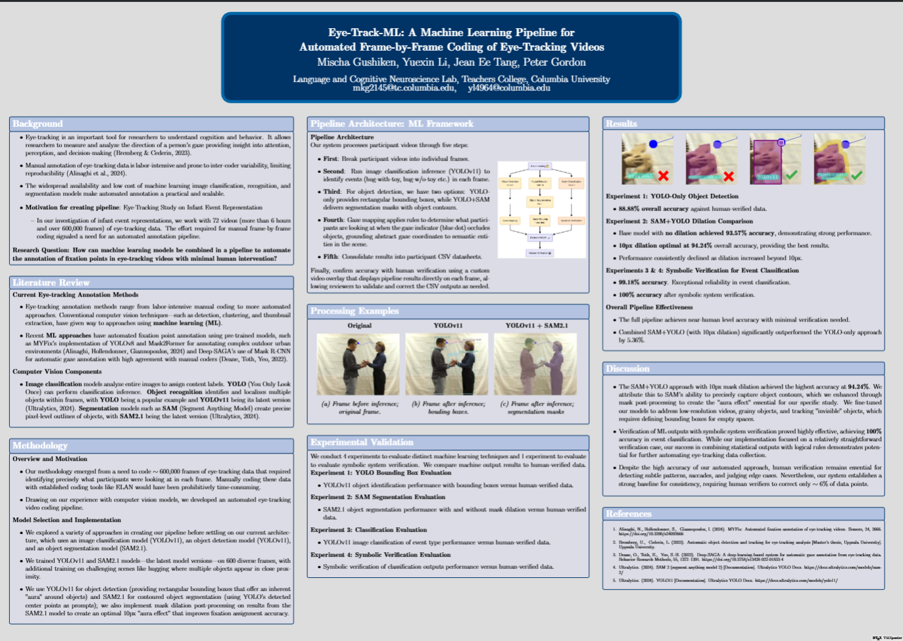

# Eye-Track-ML: Automated Eye-Tracking Video Analysis Pipeline

[](https://www.python.org/downloads/)
[](https://opensource.org/licenses/MIT)
[](https://doi.org/10.13140/RG.2.2.30558.34882)

A machine learning pipeline for automated frame-by-frame coding of eye-tracking videos, achieving 94.24% accuracy compared to human annotation. Presented at Columbia Data Science Day, AI Day, and as a guest lecture in BBSN 5022.



[📄 View Full Poster](https://www.researchgate.net/publication/390447471_Eye-Track-ML_A_Machine_Learning_Pipeline_for_Automated_Frame-by-Frame_Coding_of_Eye-Tracking_Videos)

## Scientific Motivation

Manual annotation of eye-tracking data is labor-intensive and prone to inter-coder variability, limiting reproducibility. Our infant cognition study would have required over a hundred hours of manual coding. Eye-Track-ML automates this process by combining YOLOv11 and SAM2.1 with rule-based gaze mapping, reducing human verification to ~6% of data points.

## Study Background

Developed at the Language and Cognitive Neuroscience Lab, Teachers College, Columbia University, to support research on infant event representation and attention patterns.

**Research Question:** How can machine learning models be combined to automate fixation point annotation in eye-tracking videos with minimal human intervention?

## What This Pipeline Does

Eye-Track-ML processes eye-tracking videos through an automated five-stage pipeline:

1. **Frame Extraction** - Decomposes videos into individual frames for analysis
2. **Event Classification** - Identifies event types (e.g., "giving woman object", "helping woman") using YOLOv11 image classification
3. **Object Detection/Segmentation** - Two options:
   - **YOLO-only**: Rectangular bounding boxes for object detection
   - **YOLO+SAM**: Precise segmentation masks with optional dilation for improved accuracy
4. **Gaze Mapping** - Rule-based system determines what participants are looking at when gaze indicators intersect with detected objects
5. **Data Consolidation** - Generates structured CSV datasheets with frame-by-frame annotations

**Human Verification Interface:** Custom video overlay displays pipeline predictions directly on frames, allowing efficient review and correction of the ~6% of data points that need adjustment.

## Results

We validated the pipeline through four experiments comparing machine predictions to human-verified ground truth:

| Experiment | Method | Accuracy |
|------------|--------|----------|
| **Experiment 1** | YOLO Bounding Boxes | 88.88% |
| **Experiment 2** | SAM+YOLO (No Dilation) | 93.57% |
| **Experiment 2** | SAM+YOLO (10px Dilation) | **94.24%** ⭐ |
| **Experiment 3** | Event Classification | 99.18% |
| **Experiment 4** | Event Classification + Symbolic Verification | **100.00%** |

**Findings:**
- SAM+YOLO with 10px mask dilation achieved optimal performance (94.24% accuracy)
- Combining statistical ML outputs with logical rule verification achieved perfect accuracy in event classification
- The pipeline reduces human annotation workload to ~6% of frames

## Supported Tasks

- ✅ Frame-by-frame object detection (what the participant is looking at)
- ✅ Spatial gaze mapping (where in the scene they're looking)
- ✅ Event sequence classification (categorizing interaction types)
- ✅ Temporal segmentation (approach, interaction, departure phases)
- ✅ Batch processing of multiple participants
- ✅ Human verification workflow with visual overlay

## Features

### Two Processing Modes

**YOLO Pipeline** ([pipeline/object_inference-yolo/](pipeline/object_inference-yolo/))
- Fast processing with rectangular bounding boxes
- Built-in "aura effect" from box boundaries
- 88.88% accuracy for object detection

**YOLO-SAM Pipeline** ([pipeline/object_inference-yolo-sam/](pipeline/object_inference-yolo-sam/))
- Precise contour-based segmentation
- Optional mask dilation (10px optimal)
- 94.24% accuracy for object detection

### Mask Dilation Optimization
The pipeline includes post-processing to create an optimal 10-pixel "aura" around segmented objects, improving fixation detection for gaze points near object boundaries—critical for infant eye-tracking where gaze precision varies.

### Centralized Configuration
All paths and settings managed through [pipeline/config.py](pipeline/config.py) for reproducibility across systems.

### Experiment Analysis Framework
Includes complete analysis scripts for validating pipeline performance:
- [experiment_01_analysis.py](src/experiment_01_analysis.py) - Object detection evaluation
- [experiment_02_analysis.py](src/experiment_02_analysis.py) - Event classification evaluation
- [experiment_03_analysis.py](src/experiment_03_analysis.py) - Mask dilation optimization
- [poster_visualizations.py](src/poster_visualizations.py) - Publication-ready figures

## Quick Start

```bash
# Clone the repository
git clone https://github.com/yourusername/eye-track-ml.git
cd eye-track-ml

# Install dependencies
pip install -r requirements.txt

# Run YOLO-only pipeline
python pipeline/object_inference-yolo/1_preprocessing.py
python pipeline/object_inference-yolo/2_inference_object_yolo.py
# ... continue with scripts 3-7

# Or run YOLO-SAM pipeline for higher accuracy
python pipeline/object_inference-yolo-sam/1_preprocessing.py
python pipeline/object_inference-yolo-sam/2_inference_objects_yolo_sam.py
# ... continue with scripts 3-7

# Run validation analysis
python src/experiment_01_analysis.py
python src/experiment_02_analysis.py
python src/experiment_03_analysis.py
```

## Data Requirements

**Input Format:**
- Eye-tracking videos with gaze indicators (e.g., blue dot overlay)
- Recommended: 30 FPS, various resolutions supported

**Training Data:**
- Pipeline trained on 600 diverse frames
- Additional training on challenging scenes (close proximity, occlusion)
- Handles low-resolution videos and "invisible" object tracking

**Output Format:**
Structured CSV files with frame-by-frame annotations:
```csv
Participant,Frame Number,Time,What,Where,Onset,Offset,Blue Dot Center,event_verified,trial_number,segment,participant_type,participant_age_months
Eight-0101-1579,276,00:00:09:2000,screen,other,9.2,9.2333,"(481.00, 437.50)",gwo,1,approach,infant,8
```

See [reference/](reference/) directory for complete format examples.

## Documentation

- [PIPELINE-README.md](pipeline/PIPELINE-README.md) - Detailed pipeline architecture and implementation
- [experiment_data/](experiment_data/) - Sample datasets and experiment structure
- [results/](results/) - Analysis outputs organized by experiment

## Repository Structure

```
eye-track-ml/
├── pipeline/
│   ├── object_inference-yolo/        # YOLO-only pipeline (7 scripts)
│   ├── object_inference-yolo-sam/    # YOLO+SAM pipeline (7 scripts)
│   ├── config.py                     # Centralized configuration
│   └── PIPELINE-README.md            # Detailed pipeline documentation
├── src/
│   ├── experiment_01_analysis.py     # Object detection validation
│   ├── experiment_02_analysis.py     # Event classification validation
│   ├── experiment_03_analysis.py     # Mask dilation optimization
│   └── poster_visualizations.py      # Publication figures
├── experiment_data/
│   ├── experiment_1/                 # Object inference data
│   ├── experiment_2/                 # Event inference data
│   └── experiment_3/                 # Mask dilation comparison data
├── results/
│   ├── experiment_1/                 # Object detection results
│   ├── experiment_2/                 # Event classification results
│   └── experiment_3/                 # Dilation optimization results
├── reference/                        # Sample data formats
├── archive/
│   ├── scripts/                      # Previous analysis versions
│   └── results/                      # Previous results
├── demos/                            # Demo GIFs and visualizations
└── README.md                         # This file
```

## Citation

If you use this pipeline in your research, please cite:

```bibtex
@article{gushiken2025eyetrackml,
  title={Eye-Track-ML: A Machine Learning Pipeline for Automated Frame-by-Frame Coding of Eye-Tracking Videos},
  author={Gushiken, Mischa and Li, Yuexin and Tang, Jean Ee and Gordon, Peter},
  year={2025},
  month={March},
  doi={10.13140/RG.2.2.30558.34882},
  institution={Language and Cognitive Neuroscience Lab, Teachers College, Columbia University},
  note={Presented at Columbia Data Science Day and AI Day}
}
```

**Publication:** [ResearchGate Preprint](https://www.researchgate.net/publication/390447471_Eye-Track-ML_A_Machine_Learning_Pipeline_for_Automated_Frame-by-Frame_Coding_of_Eye-Tracking_Videos)

## License

This project is licensed under the MIT License - see the [LICENSE](LICENSE) file for details.

## Acknowledgments

**Research Team:**
- Mischa Gushiken (mkg2145@tc.columbia.edu)
- Yuexin Li (yl4964@columbia.edu)
- Jean Ee Tang
- Dr. Peter Gordon - Principal Investigator

**Presentations:**
- Columbia Data Science Day 2025
- Columbia AI Day 2025
- Guest Lecture, BBSN 5022 (Dr. Jean Tang-Lonardo)

**Lab:** Language and Cognitive Neuroscience Lab, Teachers College, Columbia University

---

**References:**
1. Alinaghi, N., et al. (2024). MYFix: Automated fixation annotation of eye-tracking videos. *Sensors*, 24, 2666. https://doi.org/10.3390/s24092666
2. Deane, O., et al. (2022). Deep-SAGA: A deep-learning-based system for automatic gaze annotation. *Behavior Research Methods*, 55, 1372–1391. https://doi.org/10.3758/s13428-022-01833-4
3. Ultralytics. (2024). YOLO11 Documentation. https://docs.ultralytics.com/models/yolo11/
4. Ultralytics. (2024). SAM 2 Documentation. https://docs.ultralytics.com/models/sam-2/
